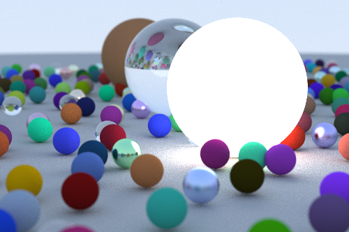
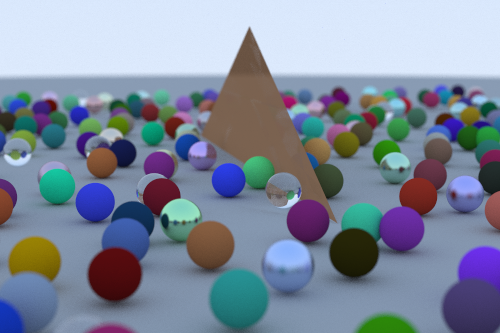

# raytracer
3D raytracer written in C++.

## Features
- Support for multiple materials (lambertian, metal, dielectric, light)
- Positional camera
- Triangle
- Multiprocessing render
- Focus
- Anti-aliasing

## Demo
Multiple materials:

Support for spheres and triangles:

Focus blur:

